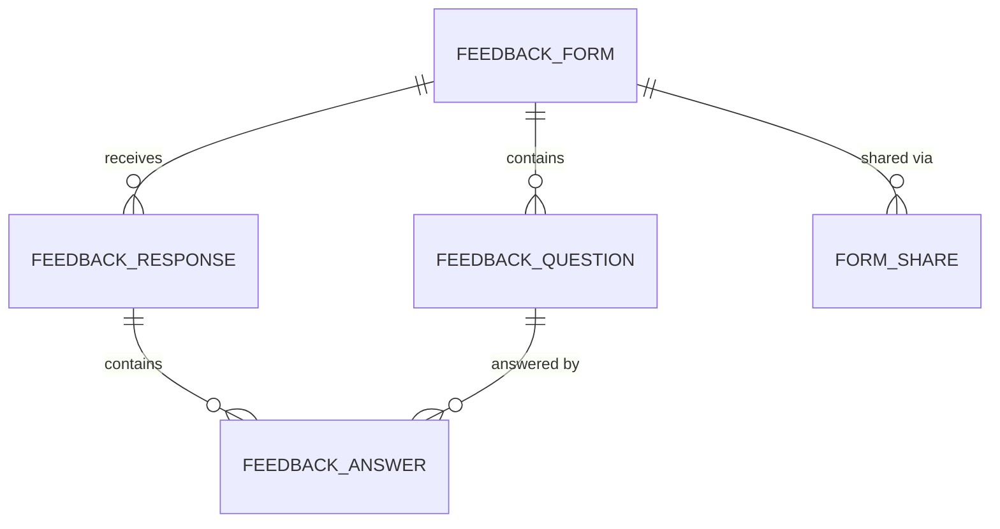

# Entity Model

## Entity Relationship Diagram

### FEEDBACK_FORM

A feedback form created by an authenticated user to collect feedback for an event or presentation.

| Attribute   | Description                          | Data Type | Length/Precision | Validation Rules          |
|-------------|--------------------------------------|-----------|------------------|---------------------------|
| id          | Unique identifier                    | Long      | 19               | Primary Key, Sequence     |
| title       | Title of the feedback form           | String    | 255              | Not Null                  |
| speakerName | Name of the speaker                  | String    | 255              | Optional                  |
| eventDate   | Date of the event                    | Date      | -                | Optional                  |
| location    | Location of the event                | String    | 255              | Optional                  |
| status      | Current status of the form           | String    | 10               | Not Null, Values: DRAFT, PUBLIC, CLOSED |
| publicToken | Unique token for public access       | String    | 36               | Not Null, Unique          |
| ownerEmail  | Email of the form creator            | String    | 255              | Optional                  |
| createdAt   | Timestamp when the form was created  | DateTime  | -                | Not Null                  |

### FEEDBACK_QUESTION

A question belonging to a feedback form, either a rating or free-text question.

| Attribute    | Description                          | Data Type | Length/Precision | Validation Rules                    |
|--------------|--------------------------------------|-----------|------------------|-------------------------------------|
| id           | Unique identifier                    | Long      | 19               | Primary Key, Sequence               |
| form_id      | Reference to the feedback form       | Long      | 19               | Not Null, Foreign Key (FEEDBACK_FORM.id) |
| questionText | Text of the question                 | String    | 500              | Not Null                            |
| questionType | Type of question                     | String    | 10               | Not Null, Values: RATING, TEXT      |
| orderIndex   | Display order of the question        | Integer   | 10               | Not Null                            |

### FEEDBACK_RESPONSE

A submitted feedback response from an anonymous user for a specific form.

| Attribute   | Description                             | Data Type | Length/Precision | Validation Rules                    |
|-------------|-----------------------------------------|-----------|------------------|-------------------------------------|
| id          | Unique identifier                       | Long      | 19               | Primary Key, Sequence               |
| form_id     | Reference to the feedback form          | Long      | 19               | Not Null, Foreign Key (FEEDBACK_FORM.id) |
| submittedAt | Timestamp when the response was submitted | DateTime  | -                | Not Null                            |

### FEEDBACK_ANSWER

An individual answer to a question within a feedback response.

| Attribute   | Description                          | Data Type | Length/Precision | Validation Rules                          |
|-------------|--------------------------------------|-----------|------------------|-------------------------------------------|
| id          | Unique identifier                    | Long      | 19               | Primary Key, Sequence                     |
| response_id | Reference to the feedback response   | Long      | 19               | Not Null, Foreign Key (FEEDBACK_RESPONSE.id) |
| question_id | Reference to the feedback question   | Long      | 19               | Not Null, Foreign Key (FEEDBACK_QUESTION.id) |
| ratingValue | Numeric rating value                 | Integer   | 10               | Optional, Min: 1, Max: 5                 |
| textValue   | Free-text answer                     | String    | 2000             | Optional                                  |

### FORM_SHARE

A sharing record granting another user access to a feedback form.

| Attribute       | Description                          | Data Type | Length/Precision | Validation Rules                    |
|-----------------|--------------------------------------|-----------|------------------|-------------------------------------|
| id              | Unique identifier                    | Long      | 19               | Primary Key, Sequence               |
| form_id         | Reference to the feedback form       | Long      | 19               | Not Null, Foreign Key (FEEDBACK_FORM.id) |
| sharedWithEmail | Email of the user granted access     | String    | 255              | Not Null, Format: Email             |

**Constraints:** Unique combination of (form_id, sharedWithEmail).

### ACCESS_TOKEN

A temporary login token sent via email for passwordless authentication.

| Attribute | Description                          | Data Type | Length/Precision | Validation Rules      |
|-----------|--------------------------------------|-----------|------------------|-----------------------|
| id        | Unique identifier                    | Long      | 19               | Primary Key, Sequence |
| email     | Email address of the user            | String    | 255              | Not Null, Format: Email |
| token     | The 8-digit login code               | String    | 8                | Not Null, Unique      |
| used      | Whether the token has been consumed  | Boolean   | 1                | Not Null              |
| createdAt | Timestamp when the token was created | DateTime  | -                | Not Null              |
| expiresAt | Timestamp when the token expires     | DateTime  | -                | Optional              |
